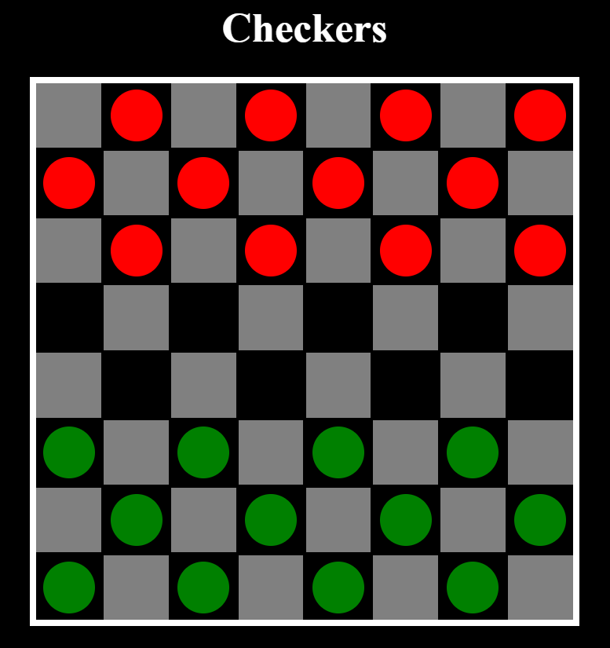

# Damspil med Minimax og Alpha-Beta Pruning



## Link til deployet udgave
[Checkers Game](https://aeaj.github.io/Checkers-/)

## Kort beskrivelse

Dette er et damespil implementeret med Model-View-Controller (MVC) mønsteret. Spillet inkluderer en AI-modstander, som bruger Minimax-algoritmen med Alpha-Beta Pruning til beslutningstagning.

## Algoritmer og datastrukturer

### Minimax og Alpha-Beta Pruning
Minimax-algoritmen bruges til at finde det bedste træk ved at simulere alle mulige træk fremad i spillet og evaluere dem. Alpha-Beta Pruning forbedre Minimax ved at sortere unødvendige træk fra, som ikke vil påvirke den endelige beslutning, hvilket gør algoritmen mere effektiv.

### Datastrukturer
- **Board**: Repræsenteret som et 2D-array, hvor hvert element kan være en brik tilhørende:
  Spiller 1 (1), 
  Spiller 2 (2), 
  Kongebrik for spiller 1 (3),
  Kongebrik for spiller 2 (4),
  Eller et tomt felt (0).

## Sådan kører du visualiseringen lokalt

For at køre spillet lokalt:

1. Klon repositoriet:
    ```bash
    git clone https://github.com/aeaj/Checkers-.git
    cd checkers-game
    ```

2. Åbn `index.html` i din webbrowser:
    ```bash
    start index.html  # For Windows
    ```

3. Spil spillet!

## Features

- Player 1: Human player
- Player 2: AI opponent using Minimax with Alpha-Beta Pruning
- Standard checkers rules, including mandatory jumps, king promotion, and multiple jumps.


